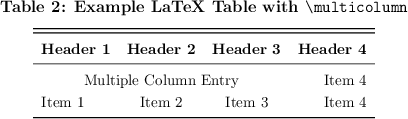
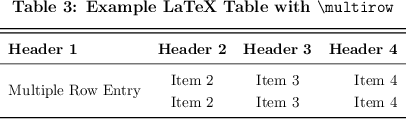

*******************************************
Examples: LaTeX Tables
*******************************************

.. include:: example_note.rst

General Notes Regarding Tables
===========================================

Text

Referencing Tables
===========================================

Text

Table with Caption
===========================================

Text

.. literalinclude:: latex/tex/table.tex
   :language: latex

Table Using :code:`\multicol{}`
===========================================

Text

.. literalinclude:: latex/tex/table_column.tex
   :language: latex

Table Using :code:`\multirow{}`
===========================================

Text

.. literalinclude:: latex/tex/table_row.tex
   :language: latex

