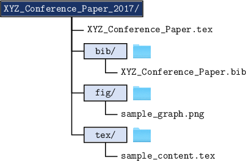

*******************************************
Quick Start Guide
*******************************************

The fastest and most efficient way to start a new document is utilize the :code:`buildPDF.py` script's :code:`--structure` option in order to create a document tree with the minimum necessary files. For example, let's assume you would like to create a new document whose main (root) :code:`.tex` is to be titled :code:`XYZ_Conference_Paper.tex` (it does not currently exist) and you want all the document content to be housed in a directory named :code:`XYZ_Conference_Paper_2017/`. All of this may be accomplished through the following:

::

   ./buildPDF.py XYZ_Conference_Paper.tex -s XYZ_Conference_Paper_2017

This will create a document with the same structure as described in the general document `architecture <architecture.html#general-document-architecture>`_ section as well as some sample files that can be used as starting points for expanding the document and placeholder `Lorem Ipsum <http://www.lipsum.com/>`_ text.

The Root TeX File
===========================================

Once the new document folder is created, it will contain your :code:`XYZ_Conference_Paper.tex` file with the following contents:

.. literalinclude:: latex/XYZ_Conference_Paper_2017/XYZ_Conference_Paper.tex
   :language: latex

Currently, the document will be built with no template and in turn no pre-defined formatting. We can specify that we would like to create an AIAA conference paper by calling that :code:`aiaa-conference` template as follows:

:: 
   
   \documentclass[template=aiaa-conference]{nasa-latex-docs}

We can now build the entire document via:

::

   ./buildPDF.py XYZ_Conference_Paper.tex

From here more content can be added and the document can grow as required.  

Declaring the Root Tex File
===========================================

A neat feature of :code:`buildPDF.py` is that it can pick up "magic" comments that are used by some other document compilers. Specifically, a magic comment can be placed at the top of each content file (located in the :code:`tex/` directory) so that the TeX root document can be explicitly defined. Suppose we create a new file within :code:`tex/` named :code:`introduction.tex` with the following:

.. code-block:: latex

   %!TEX root = ../XYZ_Conference_Paper.tex

   \section{Introduction}

   This is my introduction section.

We can either use :code:`buildPDF.py` to build the root :code:`XYZ_Conference_Paper.tex` file directly as described above, or we can build :code:`introduction.tex` directly and :code:`buildPDF.py` will know to point to the root document.

::

   ./buildPDF.py tex/introduction.tex

This is useful for any custom defined build shortcuts (example a keyboard shortcut to directly call :code:`buildPDF.py`) that users may come up with. By placing the :code:`%!TEX root =` comment at the top of each file it allows users to utilize the shortcuts to build the document without having to physically switch back to the root document.  